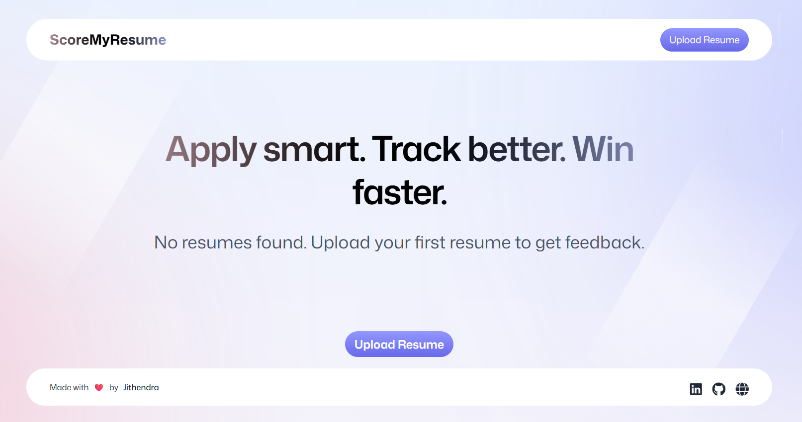
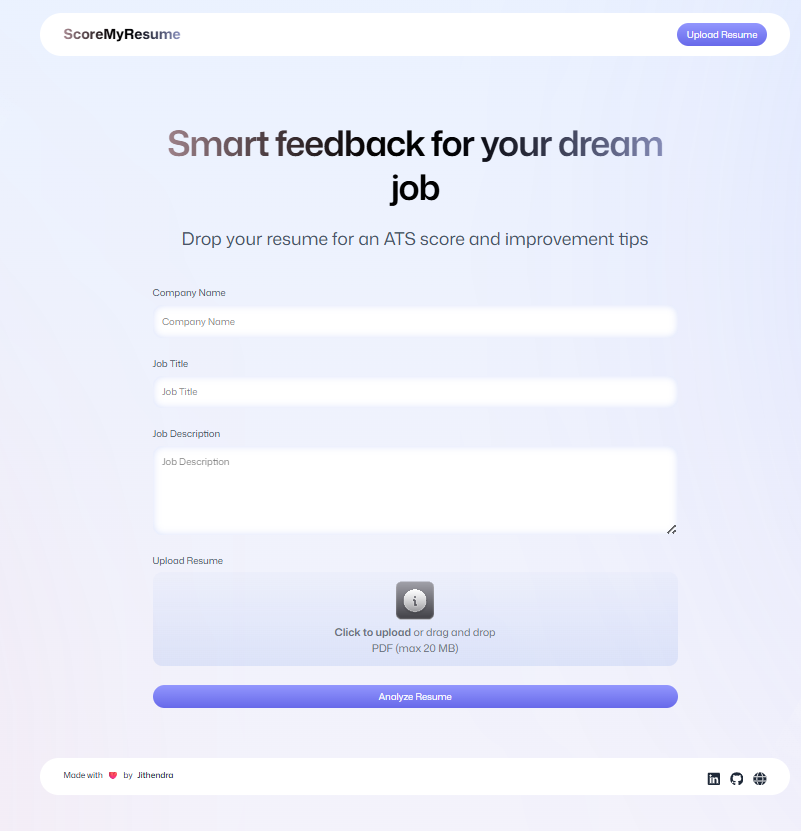
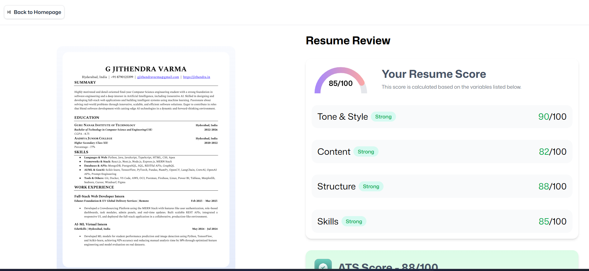

# ScoreMyResume

[](https://jithendra.in/)
[](https://www.linkedin.com/in/jithendra11/)

---

## 🚀 Overview

**ScoreMyResume** is a modern, AI-powered web application that analyzes your resume against any job description and provides an ATS (Applicant Tracking System) compatibility score. Instantly see how well your resume aligns and get actionable insights to improve your chances of getting noticed by recruiters.

🔗 **Live Demo:** [scoremyresume.jithendra.in](https://scoremyresume.jithendra.in)

## 🖼️ Screenshots

<div align="center">
  <h3>🏠 Homepage</h3>
  
  <br/>
  <h3>📤 Upload Resume</h3>
   <p>The page where users can upload their resumes for ATS scoring and analysis.</p>
  
  <br/>
  <h3>📊 Analysis Result</h3>
  <p>Displays the ATS score and a detailed breakdown of the resume analysis.</p>
  
</div>

---

## 🛠️ Tech Stack

-------------------------------------------------------------------
| Layer         | Technology                                      |
|---------------|-------------------------------------------------|
| Frontend      | React, TypeScript, Tailwind CSS, React Router   |
| State         | Zustand                                         |
| Cloud/Backend | Puter.js (file storage, AI, key-value, auth)    |
| AI Model      | Claude Sonnet 4                                 |
| PDF Handling  | PDF.js                                          |
| Utilities     | clsx, tailwind-merge                            |
-------------------------------------------------------------------

## 📂 File Structure

```
app/
│
├── app.css
├── root.tsx
├── routes.ts
│
├── components/
│   ├── Accordion.tsx
│   ├── ATS.tsx
│   ├── Details.tsx
│   ├── FileUploader.tsx
│   ├── Footer.tsx
│   ├── Navbar.tsx
│   ├── ResumeCard.tsx
│   ├── ScoreBadge.tsx
│   ├── ScoreCircle.tsx
│   ├── ScoreGauge.tsx
│   └── Summary.tsx
│
├── lib/
│   ├── pdf2img.ts
│   ├── puter.ts
│   └── utils.ts
│
└── routes/
    ├── auth.tsx
    ├── home.tsx
    ├── resume.tsx
    ├── upload.tsx
    └── wipe.tsx


---

## ⚡ Getting Started

### Prerequisites

- Node.js (v18+ recommended)
- Yarn or npm

### Installation

```bash
git clone https://github.com/Jithendra1101/ScoreMyResume.git
cd ScoreMyResume
npm install
```

### Running Locally

```bash
npm run dev
```

Visit [http://localhost:5173](http://localhost:5173) in your browser.

---

## 📝 Usage

1. **Sign In:** Authenticate via Puter.js.
2. **Upload Resume:** Drop your PDF resume file.
3. **Enter Job Details:** Fill in the company name, job title, and job description.
4. **Analyze:** Click to get your ATS score and improvement tips.
5. **Review Results:** See detailed feedback and actionable suggestions.

---

## 🤖 How It Works

- **Upload:** Resume is uploaded and converted to an image for preview.
- **AI Analysis:** Resume and job details are sent to Claude Sonnet 4 via Puter.js for analysis.
- **Feedback:** AI returns a structured JSON with ATS score and category breakdowns.
- **Display:** Results are visualized and stored for future reference.

---

## 📦 Deployment

- **Frontend:** I had Deployed it on Vercel.you can choose Vercel, Netlify, or your preferred static hosting.
- **Backend/AI:** Handled by Puter.js cloud services.

---

## 🙋 FAQ

**Q: What file types are supported?**  
A: Currently, only PDF resumes are supported for analysis.

**Q: Is my data secure?**  
A: Yes, all files and analysis results are securely stored via Puter.js and are only accessible to the authenticated user.

**Q: Can I analyze multiple resumes?**  
A: Yes, you can upload and analyze as many resumes as you like.

**Q: How accurate is the ATS score?**  
A: The score is generated by Claude Sonnet 4 AI based on your resume and the job description. It provides a strong indication of ATS compatibility, but results may vary depending on the job and resume content.

**Q: Can I use this for any job description?**  
A: Yes, you can paste any job description to get tailored feedback for your resume.

**Q: What happens to my data after analysis?**  
A: Your data is stored securely and can be deleted at any time by the user.

**Q: Who built this project?**  
A: This project was built by Jithendra Varma. See contact details below.

---


## 📄 License

MIT License

---

## 📫 Contact

- **Portfolio:** [jithendra.in](https://jithendra.in)
- **LinkedIn:** [linkedin.com/in/jithendra11/](https://www.linkedin.com/in/jithendra11/)
- **Email:** [gjithendravarma@gmail.com](mailto:gjithendravarma@gmail.com)

---

> Made with ❤️ by Jithendra Varma
